# Галерея / Gallery

Все изображения ниже сняты непосредственно с актуальной сборки Aetheria `v0.1.0-test` на Godot 4.5. Это не концепт-арты и не старые макеты интерфейса.

Every image below was rendered directly from the current Aetheria `v0.1.0-test` build running on Godot 4.5. These are not concept mockups.

## Основные экраны / Main screens

### Главное меню / Main menu

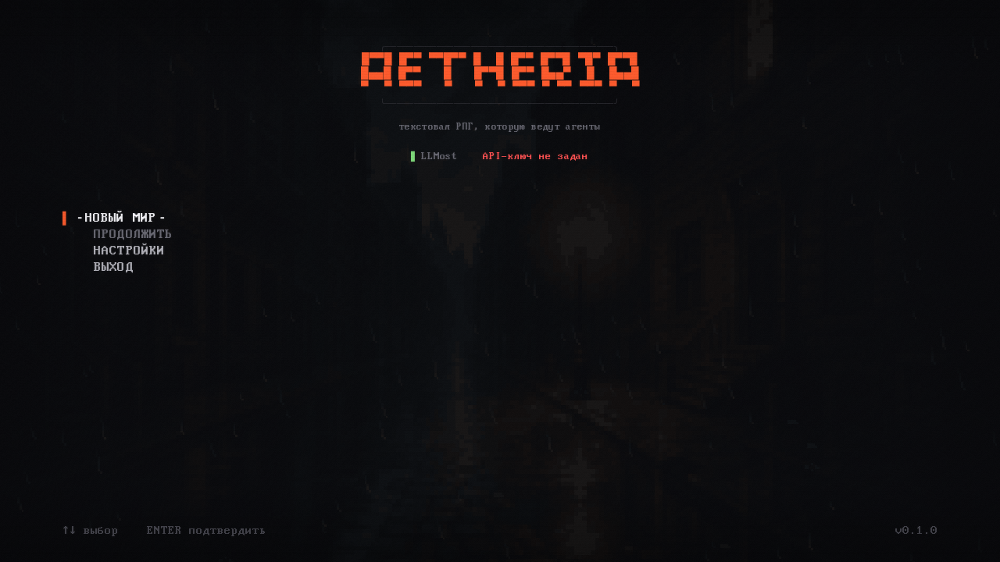

### Создание мира / World creation

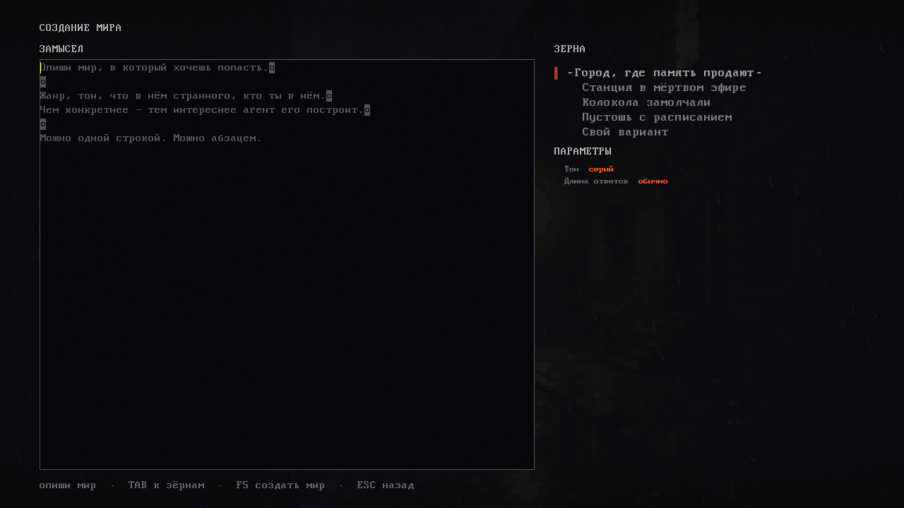

### Создание персонажа / Character creation

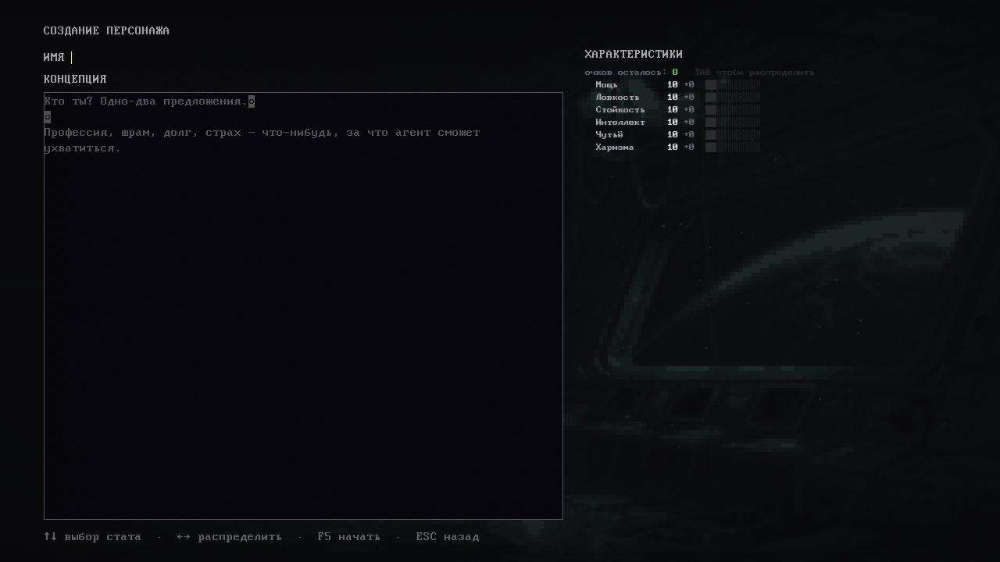

## Настройки / Settings

### Провайдер / Provider

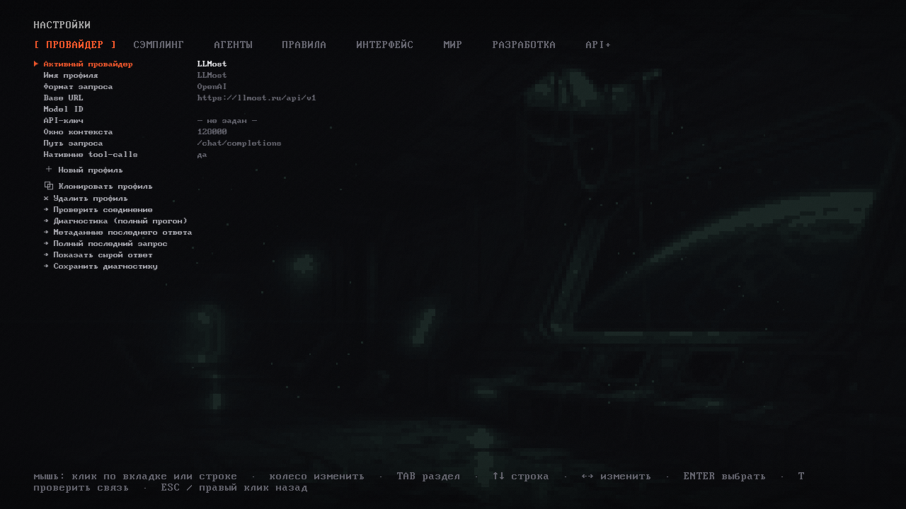

### Сэмплинг / Sampling

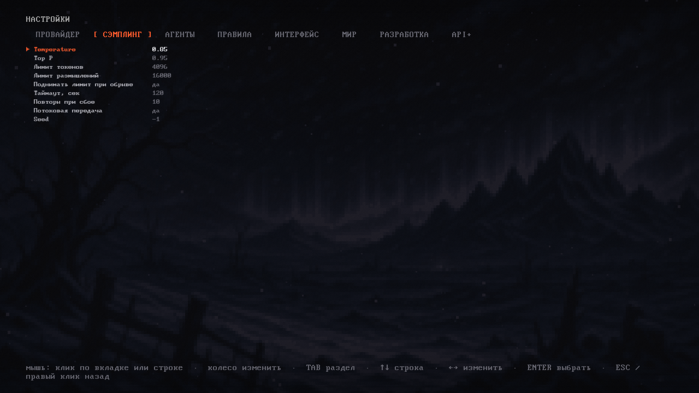

### Агенты / Agents

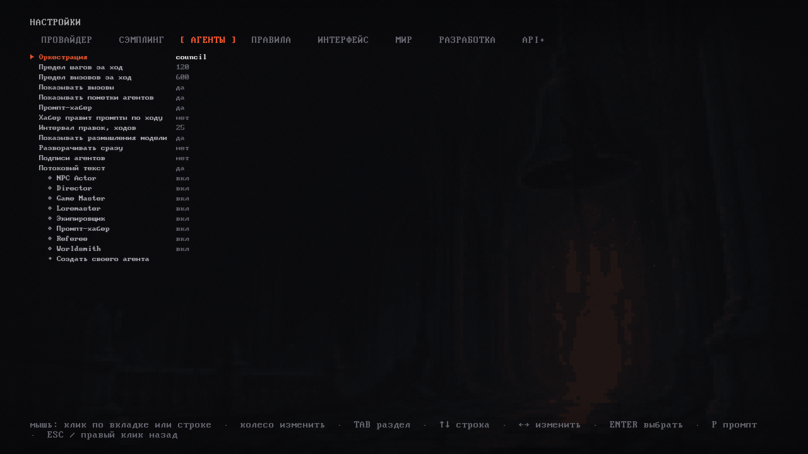

### Интерфейс / Interface

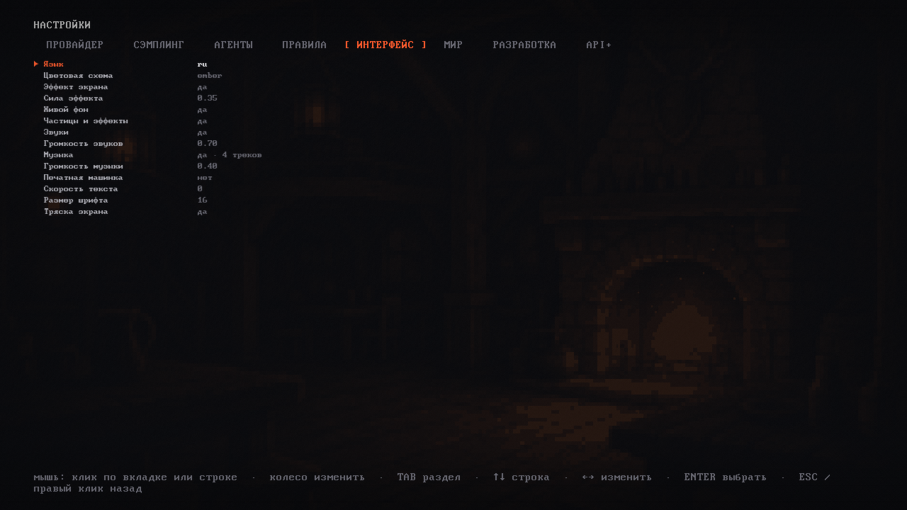

### Расширенные параметры API / Advanced API controls

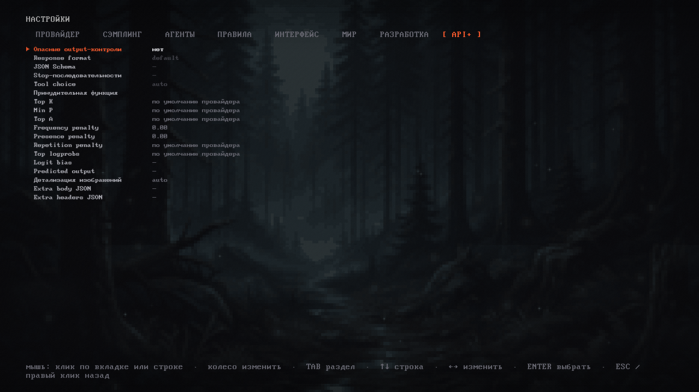

## Игра и панели / Gameplay and drawers

### Основная лента / Main narrative stream

### Характеристики / Character

### Снаряжение / Inventory

### Мир / World

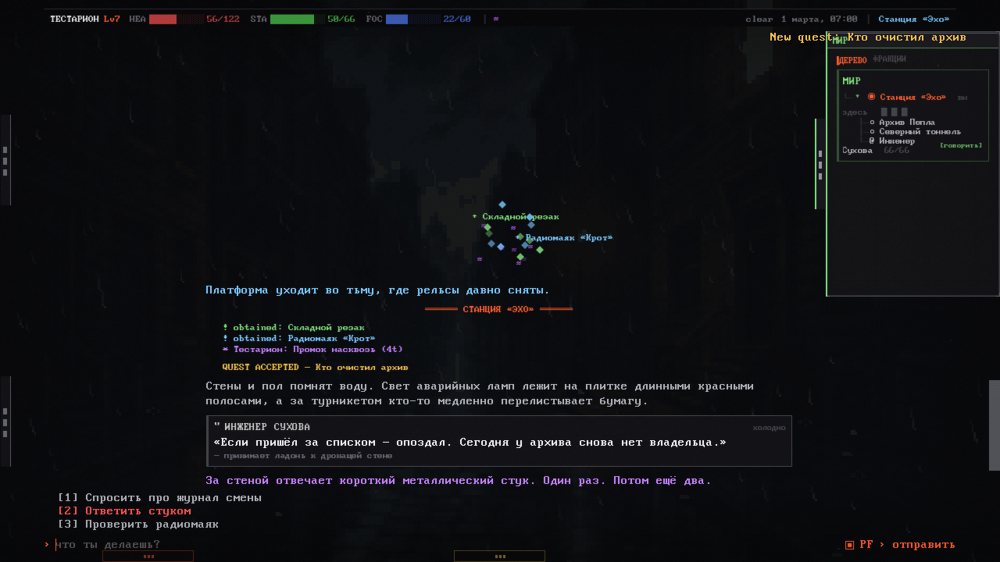

### Кодекс / Codex

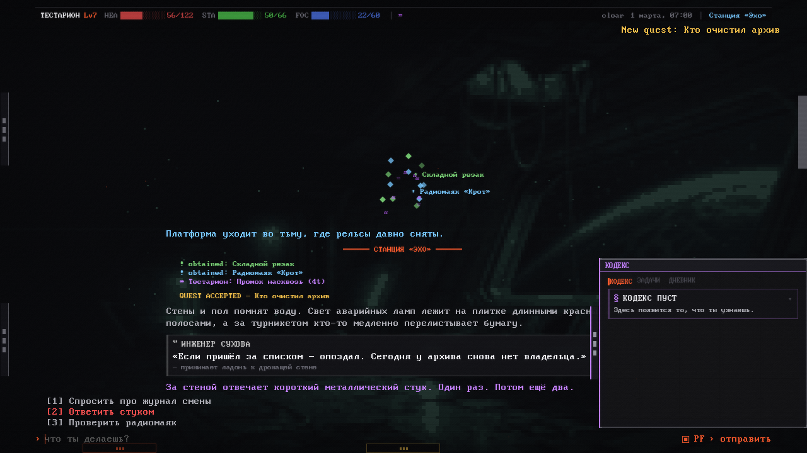

### Система / System

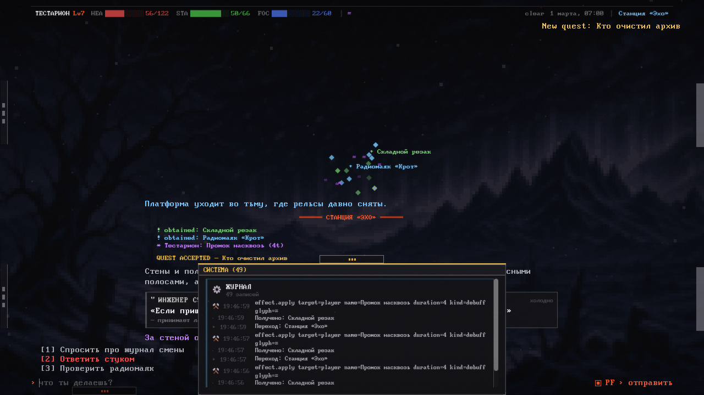

### Терминал / Terminal

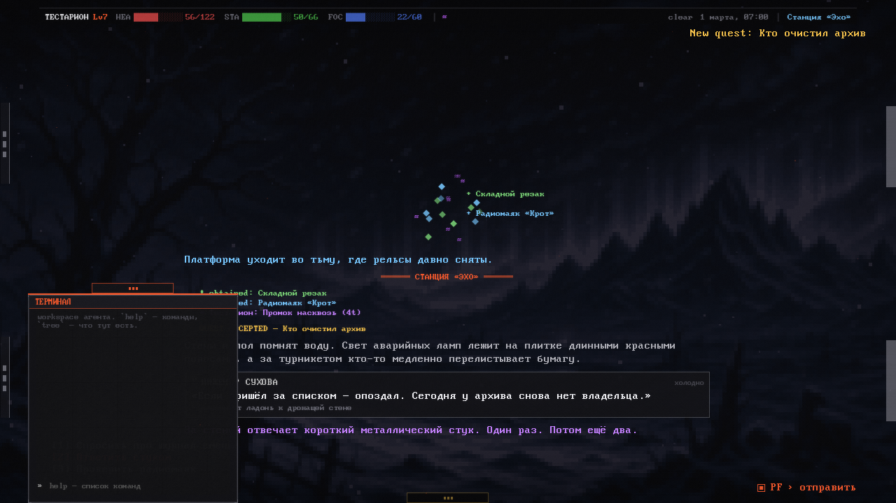

## Системные экраны / System screens

### Пауза / Pause

### Отложенная подсказка / Delayed tooltip

### Список сохранений / Save browser

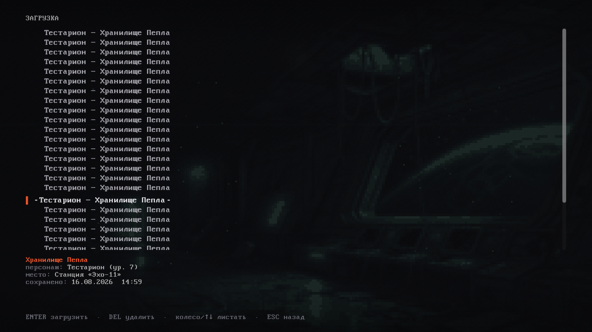
