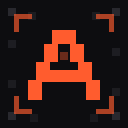
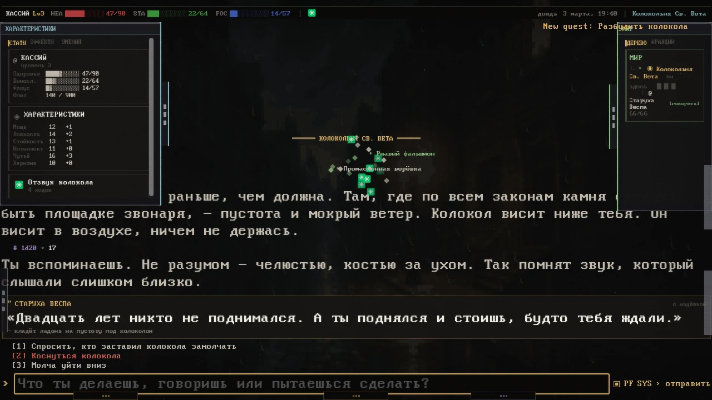
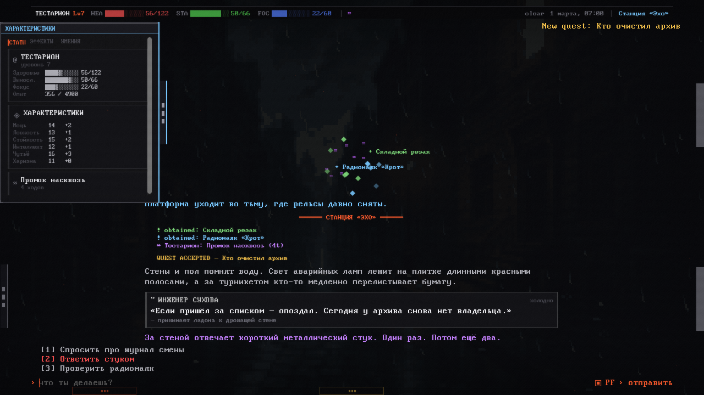
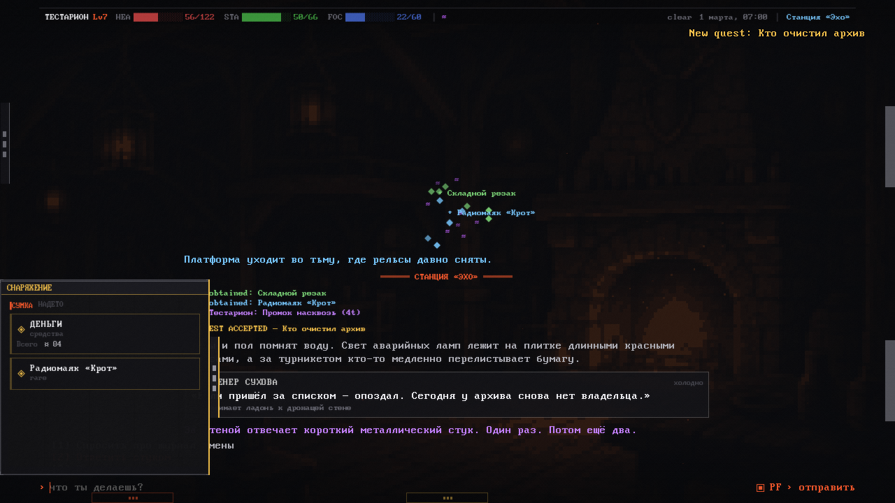
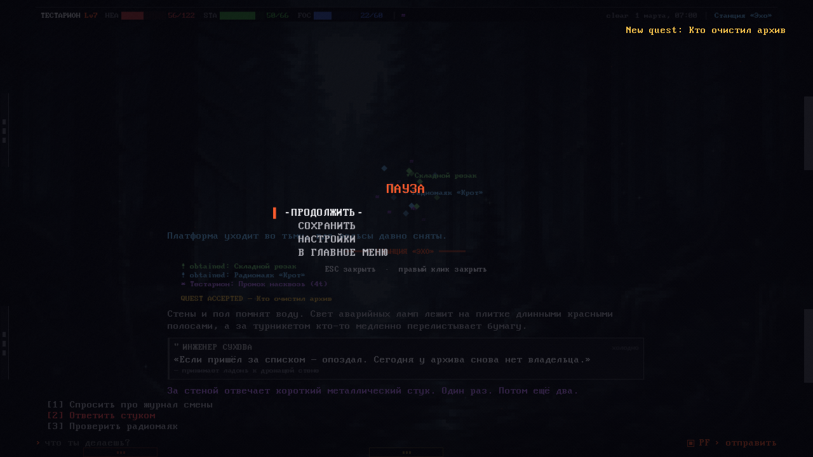
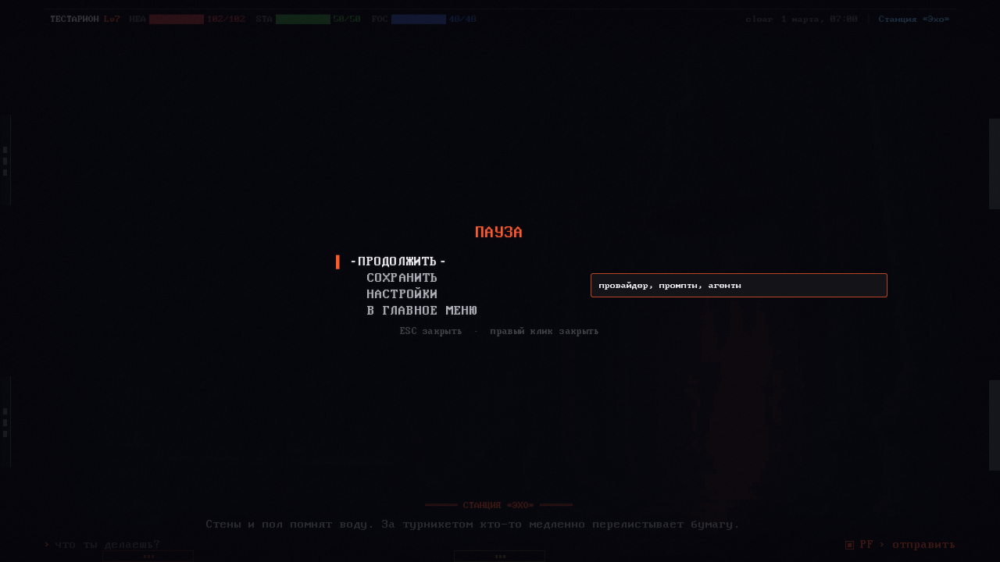

<p align="center">
  
</p>

<h1 align="center">Aetheria</h1>

<p align="center">
  A text RPG where LLM agents operate the world through a real game-tool layer.
</p>

<p align="center">
  <a href="README.md">Русский</a> ·
  <a href="GALLERY.md">Gallery</a> ·
  <a href="https://github.com/ai-pop/aetheria-rpg/releases/tag/v0.1.0-test">Download</a> ·
  <a href="https://github.com/ai-pop/aetheria-rpg/issues">Report a bug</a> ·
  <a href="https://github.com/ai-pop/aetheria-rpg/discussions">Discussions</a>
</p>

> [!IMPORTANT]
> This is the public distribution repository. It hosts builds, project information, release history, and community feedback. **It does not contain the source code.**

## Download

Current test build: **v0.1.0-test** for Windows x86_64.

[**Download Aetheria for Windows →**](https://github.com/ai-pop/aetheria-rpg/releases/tag/v0.1.0-test)

1. Download `Aetheria-0.1.0-win64-test.zip`.
2. Extract the archive.
3. Run `Aetheria-0.1.0-win64.exe`.

Windows SmartScreen may warn because the test executable is not yet signed with a commercial certificate. Every release includes its SHA-256 checksum.

## About the game

Aetheria is not a chat wrapper. The model receives strictly defined tools and uses them to change persistent game state: locations, NPCs, inventory, checks, combat, time, quests, and consequences.

- **Agents as world participants.** Head GM orchestrates the turn, a separate Narrative GM renders established facts, and Worldsmith, Referee, Loremaster, Director, NPC Actor, Prompt Hubber, and Outfitter follow their own strict roles.
- **Council as a mandatory loop stage.** All agents agree on the plan before world creation and review the finished result; every normal turn begins with 1–3 relevant specialists.
- **Physical hands instead of an “equippable” flag.** A phone, cup, keys, stone, or any other item can be held in either hand.
- **Private Markdown OOC.** The Head GM F6 channel supports formatted replies and is mechanically isolated from Narrator and the game scene.
- **State instead of hand-waving.** Entities, equipment, effects, quests, factions, the story clock, and rules live in the engine.
- **Rules as data.** Stats, resources, formulas, and damage types can grow without rewriting the core game.
- **Autonomous NPCs.** Characters receive a voice, memory, goals, equipment, and their own agent context.
- **Multiple LLM providers.** LLMost, OpenAI-compatible APIs, OpenRouter, Groq, DeepSeek, local Ollama/LM Studio, and native Anthropic.
- **Actionable connection failures.** Network/API errors show a clear reason and let the player resume the interrupted turn or open provider settings.
- **Russian and English UI.** Switch languages in Settings.

## Current screenshots

Every image comes from the current build, not an old UI mockup.



<p align="center">
  
  
</p>

<p align="center">
  
  
</p>

[**Open the complete gallery of 18 current screenshots →**](GALLERY.md)

## Connecting a model

Aetheria requires a configured cloud or local LLM model:

1. Open **Settings → Provider**.
2. Select a profile or create one.
3. Enter the Base URL, Model ID, and API key.
4. Run **Test connection** or the full tool-calling diagnostic.

A built-in LLMost profile uses:

```text
https://llmost.ru/api/v1
```

API keys remain local in `user://secrets.json`. They are never included in save files or diagnostic exports.

## System requirements

- Windows 10/11 x86_64;
- an OpenGL 3.3-capable GPU;
- internet access for cloud LLM providers;
- an API key for the selected cloud service, or a configured local Ollama/LM Studio model.

Settings and save files are stored under:

```text
%APPDATA%\Godot\app_userdata\Aetheria
```

## Feedback

- Bugs and launch problems: [Issues](https://github.com/ai-pop/aetheria-rpg/issues)
- Ideas, questions, and playtest reports: [Discussions](https://github.com/ai-pop/aetheria-rpg/discussions)

When filing an issue, include:

- your Windows version;
- the Aetheria version;
- provider and Model ID — **never your API key**;
- reproduction steps;
- a screenshot or diagnostic JSON from `user://diagnostics/`.

## Status

Aetheria is in active development. The current build is a **pre-release**: save formats, balance, UI, and agent behavior may change.

## License and third-party assets

See [LICENSE](LICENSE). Third-party fonts and sounds retain their respective licenses and attribution; details are included in the license file and the distributed build.
