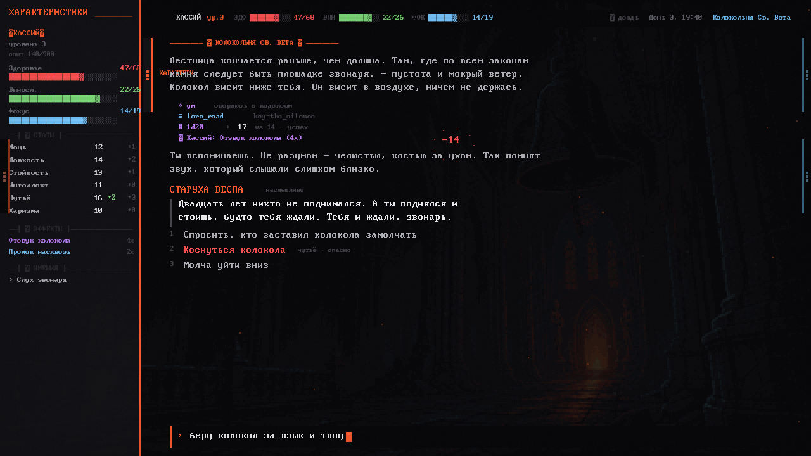
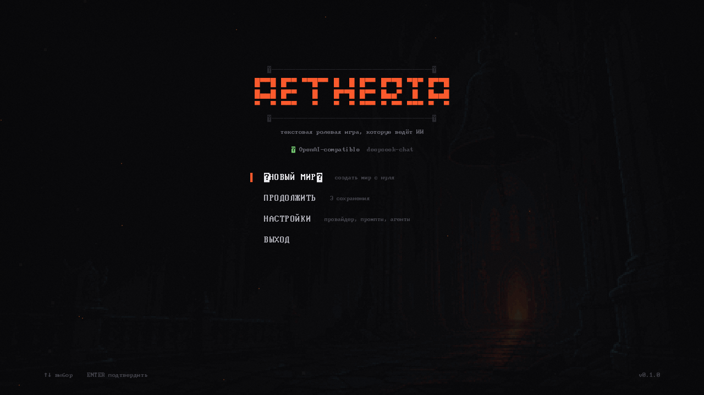
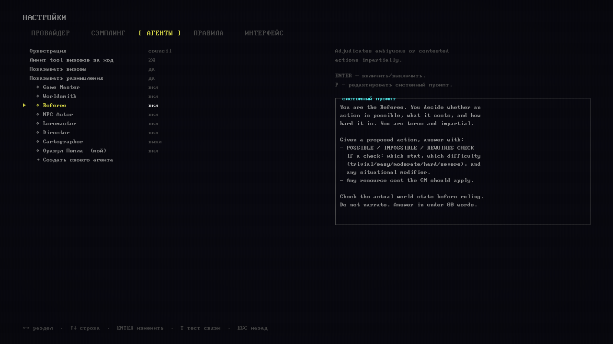

<p align="center">
  
</p>

<h1 align="center">Aetheria</h1>

<p align="center">
  Текстовая RPG, в которой LLM-агенты управляют миром через полноценный слой игровых инструментов.
</p>

<p align="center">
  <a href="README.en.md">English</a> ·
  <a href="https://github.com/ai-pop/aetheria-rpg/releases/tag/v0.1.0-test">Скачать</a> ·
  <a href="https://github.com/ai-pop/aetheria-rpg/issues">Сообщить об ошибке</a> ·
  <a href="https://github.com/ai-pop/aetheria-rpg/discussions">Обсуждения</a>
</p>

> [!IMPORTANT]
> Это публичный репозиторий распространения: здесь находятся сборки, описание проекта, история версий и обратная связь. **Исходного кода в этом репозитории нет.**

## Скачать

Текущая тестовая версия: **v0.1.0-test** для Windows x86_64.

[**Скачать Aetheria для Windows →**](https://github.com/ai-pop/aetheria-rpg/releases/tag/v0.1.0-test)

1. Скачайте `Aetheria-0.1.0-win64-test.zip`.
2. Распакуйте архив.
3. Запустите `Aetheria-0.1.0-win64.exe`.

Windows SmartScreen может показать предупреждение: тестовая сборка пока не подписана коммерческим сертификатом. Контрольная сумма SHA-256 публикуется в описании каждого релиза.

## Об игре

Aetheria — не обычный чат с моделью. ИИ получает строго описанные инструменты и через них изменяет состояние игры: создаёт и связывает локации, ведёт NPC, выдаёт предметы, разрешает проверки, проводит бой, двигает время и сохраняет последствия.

- **Агенты как участники мира.** Game Master, Worldsmith, Referee, Loremaster, Director, NPC Actor, Prompt Hubber и Outfitter работают по отдельным ролям.
- **Мир как состояние, а не импровизация.** Сущности, инвентарь, эффекты, квесты, фракции, часы и правила хранятся в движке.
- **Правила как данные.** Статы, ресурсы, формулы и типы урона можно расширять без переписывания ядра игры.
- **Автономные NPC.** Персонажи получают голос, память, цели, снаряжение и собственный агентный контекст.
- **LLM-провайдеры.** LLMost, OpenAI-compatible API, OpenRouter, Groq, DeepSeek, локальные Ollama/LM Studio и нативный Anthropic API.
- **Оффлайн-режим.** Встроенная заглушка позволяет запустить игру без API-ключа и проверить весь интерфейс.
- **Русский и English.** Интерфейс переключается в настройках.

## Скриншоты

<p align="center">
  
</p>

<p align="center">
  
  
</p>

## Настройка модели

Без ключа игра использует Offline Mock. Для подключения живой модели:

1. Откройте **Настройки → Провайдер**.
2. Выберите готовый профиль или создайте собственный.
3. Укажите Base URL, Model ID и API-ключ.
4. Нажмите **Проверить соединение** или запустите полную диагностику tools.

Для LLMost предусмотрен встроенный профиль с адресом:

```text
https://llmost.ru/api/v1
```

API-ключи хранятся только локально в `user://secrets.json`, не входят в сохранения и не отправляются в отчёты диагностики.

## Системные требования

- Windows 10/11 x86_64;
- видеокарта с поддержкой OpenGL 3.3;
- доступ в интернет для облачного LLM-провайдера;
- API-ключ выбранного сервиса — необязательно для Offline Mock.

Настройки и сохранения находятся здесь:

```text
%APPDATA%\Godot\app_userdata\Aetheria
```

## Обратная связь

- Ошибки и проблемы запуска: [Issues](https://github.com/ai-pop/aetheria-rpg/issues)
- Идеи, вопросы и впечатления: [Discussions](https://github.com/ai-pop/aetheria-rpg/discussions)

Перед созданием issue приложите:

- версию Windows;
- версию Aetheria;
- используемый LLM-провайдер и Model ID — **без API-ключа**;
- шаги воспроизведения;
- скриншот или диагностический JSON из `user://diagnostics/`.

## Статус

Проект находится в активной разработке. Текущая сборка помечена как **pre-release**: формат сохранений, баланс, интерфейс и агентные сценарии могут меняться.

## Лицензия и материалы

См. [LICENSE](LICENSE). Сторонние шрифты и звуки сохраняют собственные лицензии и атрибуцию; подробности приведены в файле лицензии и внутри дистрибутива.
